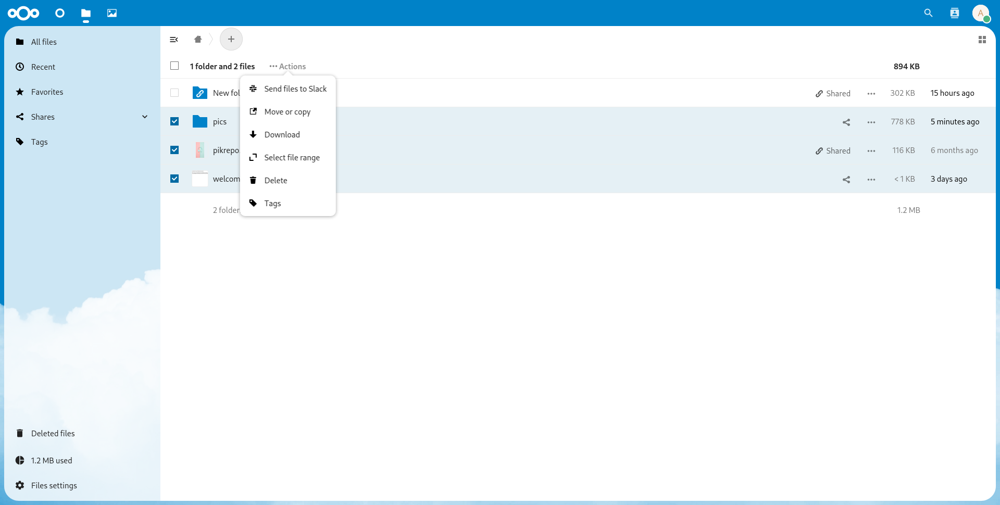
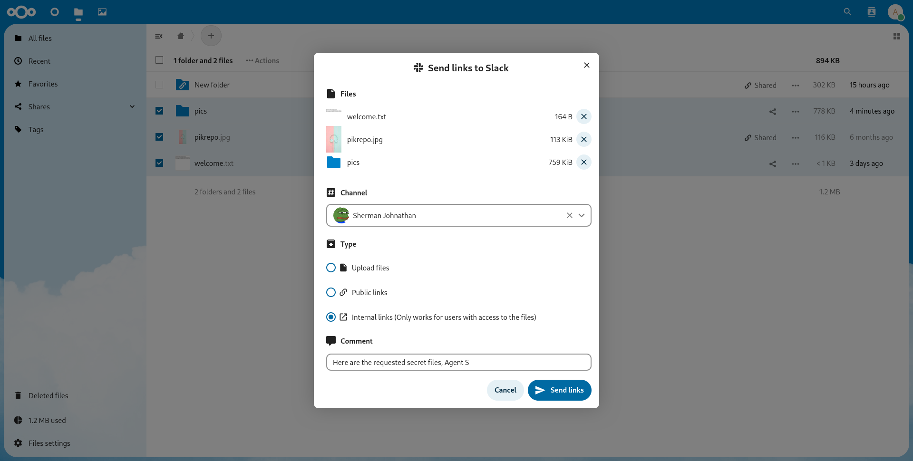

# Slack integration into Nextcloud

This integration is helpful in sending files to your Slack workspace as original
files, public links to the files or as internal Nextcloud links.

## 🔧 Configuration

### User settings

The account configuration happens in the "Connected accounts" user settings section.
It requires you to authenticate your Slack account and allow the required permissions
for the app to work nicely.

A link to the "Connected accounts" user settings section will be displayed when sending
a file to a Slack channel/chat for users who didn't configure a Slack account. The context menu
to send a file can be accessed by right clicking on the file/folder to be shared or selecting them
and clicking on the "Actions" button.

### Admin settings

There is a "Connected accounts" **admin** settings section for you (the admin) to set the OAuth
authentication keys (Client ID and Client Secret) of your Slack app for all the users to use.

You can head over to [this website](https://api.slack.com/apps) to create a Slack app.
After your app is created, go to "OAuth & Permissions" section (address looks like this:
`https://api.slack.com/apps/YOUR_APP_ID/oauth`) and set the "Redirect URL" as shown on the
Nextcloud Admin settings. 
This is also the place where you can enable token rotation, in which case your access
token would be regularly changed with a refresh token. This integration supports
both modes of operation and refreshing of the token takes place automatically.

## 🖼️ Screenshots

